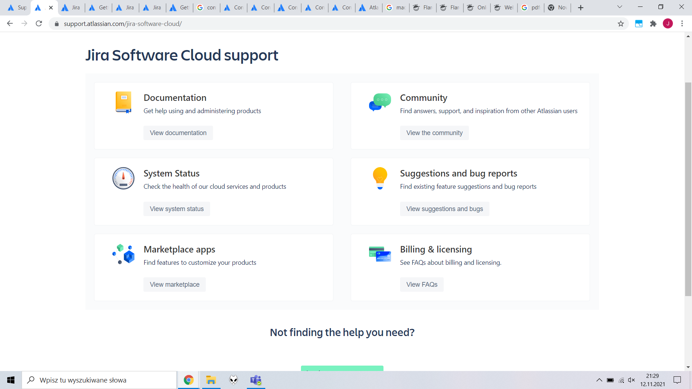

# Thoughts on JIRA, Confluence and FLARE documentation

Table of content

- [Thoughts on JIRA, Confluence and FLARE documentation](#thoughts-on-jira-confluence-and-flare-documentation)
  - [JIRA and Confluence by Atlassian](#jira-and-confluence-by-atlassian)
    - [**The good:**](#the-good)
    - [**The bad:**](#the-bad)
  - [Madcap FLARE](#madcap-flare)
    - [**The good:**](#the-good-1)
    - [**The bad:**](#the-bad-1)

## JIRA and Confluence by Atlassian

**Overview:**   
*It's easy to get lost or feel overwhelmed as it's not clear where to start initially. It gets better after you find your way through the Attlasian website. Many entrance paths are possible that eventually lead you to the specific TOCs & content.*

*My instinct was to test all the entrance paths first to make sure I didn't miss anything, which took time and finally landed me at the same webpage section. After testing the entrance paths, two main table of content sections emerged:*

*Documentation in the form of interlinked guides* 

*and Knowledge base with troubleshooting and how-to articles.*

*I liked the understated design of the website, lightweight and clean. It didn't get in the way and actually helped to navigate through the labirynths of menus. After learning how to look for content, finding information became more pleasant and effective. I started to appreciate the high volumes of data available. The fact it allows me to learn more about other interlinked Atlassian products is a smart business move and also makes life easier for people who use more than one of their products. It grew on me.*

### **The good:**
- clean page layout 

- minimalistic design 

- rich in content

- drawing user into the broader universe of Atlasian products via interlinking

### **The bad:**
Needs getting used to, the user has to learn how to use it fast, overwhelming at first, overlapping menus

## Madcap FLARE

**Overview:**  
*Compared to the Attlassian help website, Madcap FLARE's online support seemed more traditionally structured and organized. It may not be pretty but it sure is functional.*

*The layout is easy to understand. The menu is accessible without scrolling to the bottom of the page. The search is also hard to miss as it takes the central part of the initial screen. Tutorial videos and PDFs are clearly displayed and available instantly.*

### **The good:**
Simple and logical layout, instantly usable, the table of contents is always at hand, convenient search, readily available resources - videos and PDFs 

### **The bad:**
Looks a bit old-fashioned